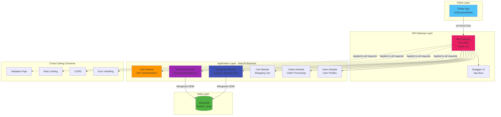
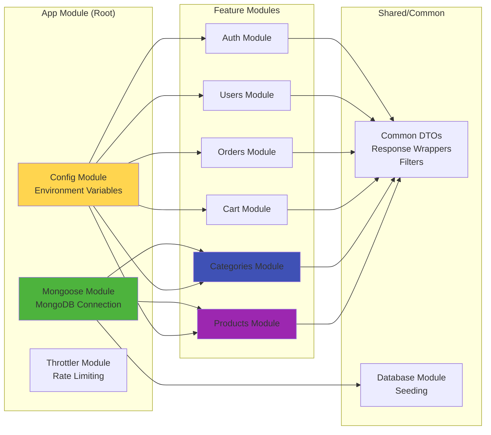
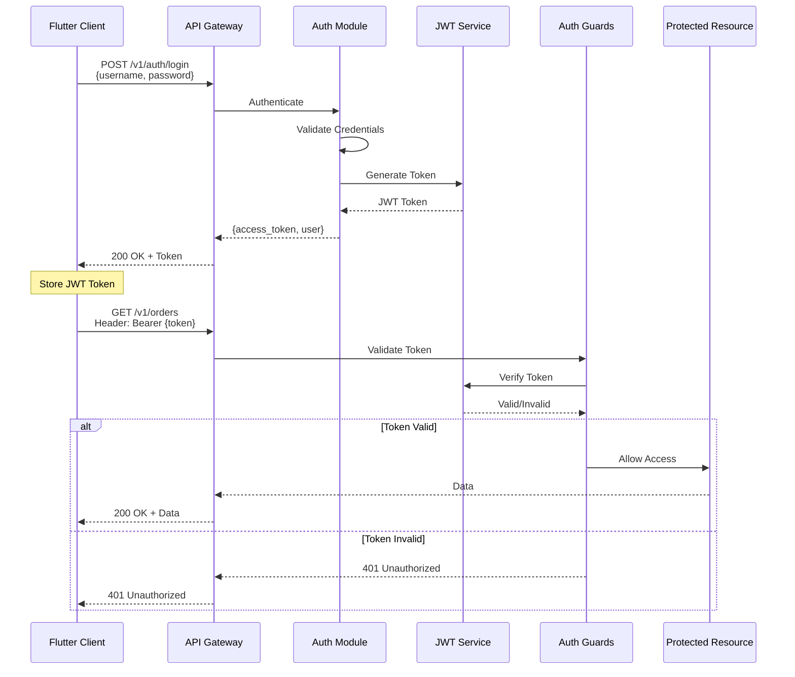
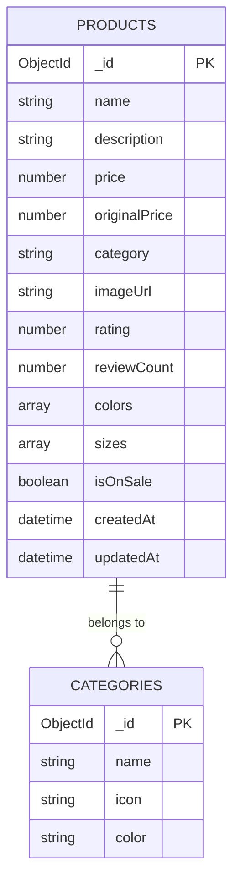
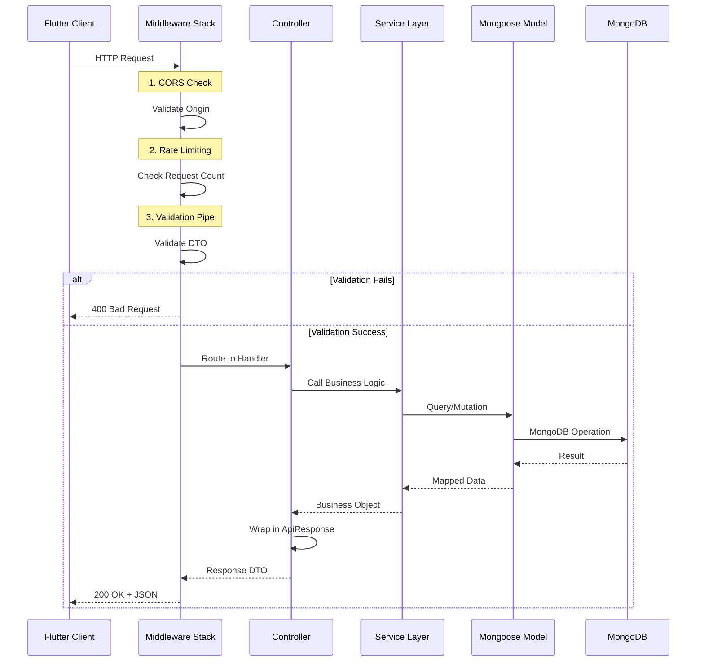
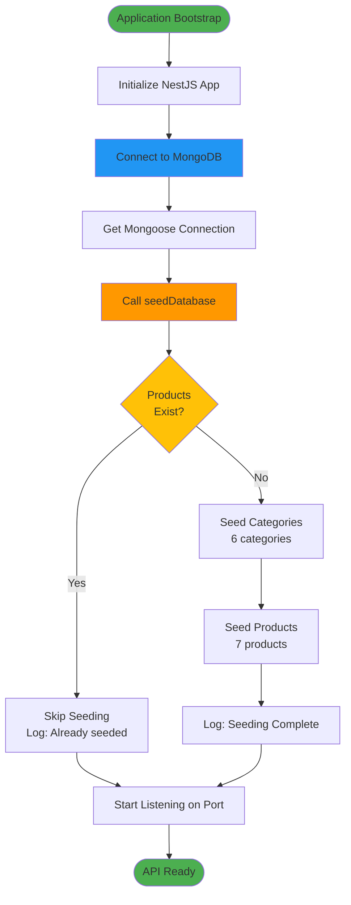
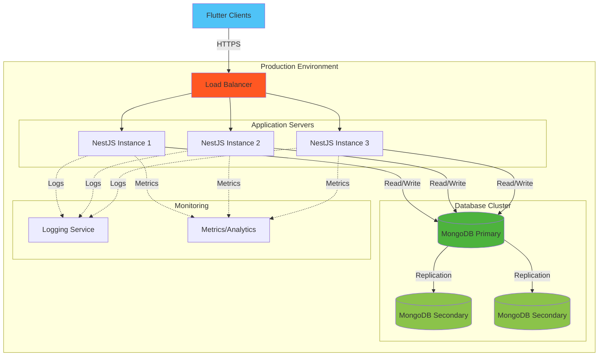

# System Architecture - Fashion Shop Backend

## Overview

Fashion Shop Backend is a NestJS-based RESTful API server that provides backend services for a Flutter fashion e-commerce application. The system uses MongoDB for data persistence and follows a modular, scalable architecture.

---

## High-Level Architecture



---

## Module Architecture



---

## Products Module - Detailed Architecture

```mermaid
graph TB
    subgraph "Products Module"
        PC[Products Controller<br/>@Controller('products')]
        PS[Products Service<br/>Business Logic]
        PE[Product Schema<br/>Mongoose Model]
    end
    
    subgraph "Routes & Endpoints"
        GET1[GET /products<br/>List all products]
        GET2[GET /products/:id<br/>Get single product]
        GET3[GET /products/search?q=<br/>Search products]
        GET4[GET /products/featured<br/>Featured products]
    end
    
    subgraph "Data Operations"
        FindAll[findAll<br/>Pagination & Filters]
        FindOne[findOne<br/>By ObjectId]
        Search[search<br/>Text search with regex]
        Featured[findFeatured<br/>Filter by isOnSale]
    end
    
    GET1 --> PC
    GET2 --> PC
    GET3 --> PC
    GET4 --> PC
    
    PC --> PS
    PS --> FindAll
    PS --> FindOne
    PS --> Search
    PS --> Featured
    
    FindAll --> PE
    FindOne --> PE
    Search --> PE
    Featured --> PE
    
    PE -->|CRUD Operations| MongoDB[(MongoDB<br/>products collection)]
    
    style PC fill:#9C27B0
    style PS fill:#7B1FA2
    style PE fill:#4A148C
    style MongoDB fill:#4DB33D
```

---

## Categories Module - Detailed Architecture

```mermaid
graph TB
    subgraph "Categories Module"
        CC[Categories Controller<br/>@Controller('categories')]
        CS[Categories Service<br/>Business Logic]
        CE[Category Schema<br/>Mongoose Model]
    end
    
    subgraph "Dependencies"
        PM[Products Module<br/>Imported]
    end
    
    subgraph "Routes & Endpoints"
        GET1[GET /categories<br/>List all categories]
        GET2[GET /categories/:id<br/>Get single category]
        GET3[GET /categories/:id/products<br/>Products by category]
    end
    
    subgraph "Data Operations"
        FindAll[findAll<br/>All categories]
        FindOne[findOne<br/>By ObjectId]
        GetProducts[getCategoryProducts<br/>Filter products by category name]
    end
    
    GET1 --> CC
    GET2 --> CC
    GET3 --> CC
    
    CC --> CS
    CS --> FindAll
    CS --> FindOne
    CS --> GetProducts
    
    FindAll --> CE
    FindOne --> CE
    
    CE -->|CRUD Operations| MongoDB[(MongoDB<br/>categories collection)]
    
    GetProducts --> PM
    PM -.->|Uses Products Service| PS[Products Service]
    
    style CC fill:#3F51B5
    style CS fill:#303F9F
    style CE fill:#1A237E
    style MongoDB fill:#4DB33D
    style PM fill:#9C27B0
```

---

## Authentication & Security Flow



---

## Database Schema



---

## Request/Response Flow



---

## Data Seeding Process



---

## Technology Stack

### Backend Framework
- **NestJS 11.1.9** - Progressive Node.js framework
- **Node.js 18+** - Runtime environment
- **TypeScript 5.9.3** - Programming language

### Database
- **MongoDB 5.0+** - NoSQL document database
- **Mongoose 8.11.1** - MongoDB ODM for Node.js

### Authentication & Security
- **@nestjs/jwt 11.0.1** - JWT token generation
- **@nestjs/passport 11.0.5** - Authentication middleware
- **passport-jwt 4.0.1** - JWT strategy for Passport
- **bcrypt 6.0.0** - Password hashing

### API Documentation
- **@nestjs/swagger 11.2.1** - OpenAPI/Swagger integration
- **Swagger UI** - Interactive API documentation

### Validation & Transformation
- **class-validator 0.14.2** - Decorator-based validation
- **class-transformer 0.5.1** - Object transformation

### Rate Limiting & Protection
- **@nestjs/throttler 6.4.0** - Rate limiting
- **CORS** - Cross-Origin Resource Sharing

---

## API Endpoints Summary

### Products API
| Method | Endpoint | Description | Auth Required |
|--------|----------|-------------|---------------|
| GET | `/v1/products` | List products with filters | No |
| GET | `/v1/products/:id` | Get product by ID | No |
| GET | `/v1/products/search?q=` | Search products | No |
| GET | `/v1/products/featured` | Get featured products | No |

### Categories API
| Method | Endpoint | Description | Auth Required |
|--------|----------|-------------|---------------|
| GET | `/v1/categories` | List all categories | No |
| GET | `/v1/categories/:id` | Get category by ID | No |
| GET | `/v1/categories/:id/products` | Products in category | No |

### Cart API
| Method | Endpoint | Description | Auth Required |
|--------|----------|-------------|---------------|
| GET | `/v1/cart` | Get cart items | Yes |
| POST | `/v1/cart/items` | Add to cart | Yes |
| PUT | `/v1/cart/items/:id` | Update cart item | Yes |
| DELETE | `/v1/cart/items/:id` | Remove from cart | Yes |
| DELETE | `/v1/cart` | Clear cart | Yes |

### Users API
| Method | Endpoint | Description | Auth Required |
|--------|----------|-------------|---------------|
| GET | `/v1/users/profile` | Get user profile | Yes |
| PUT | `/v1/users/profile` | Update profile | Yes |
| POST | `/v1/users/addresses` | Add address | Yes |

### Orders API
| Method | Endpoint | Description | Auth Required |
|--------|----------|-------------|---------------|
| GET | `/v1/orders` | List orders | Yes |
| GET | `/v1/orders/:id` | Get order details | Yes |
| POST | `/v1/orders` | Create order | Yes |
| POST | `/v1/orders/:id/cancel` | Cancel order | Yes |

### Authentication API
| Method | Endpoint | Description | Auth Required |
|--------|----------|-------------|---------------|
| POST | `/v1/auth/login` | User login | No |
| POST | `/v1/auth/register` | User registration | No |
| POST | `/v1/auth/refresh` | Refresh token | Yes |

---

## Deployment Architecture



---

## Configuration & Environment Variables

```bash
# Application
NODE_ENV=development          # Environment: development/production
PORT=3000                     # Server port
API_PREFIX=v1                 # API version prefix

# Database
MONGODB_URI=mongodb://localhost:27017/fashion_shop  # MongoDB connection string

# JWT Authentication
JWT_SECRET=your-secret-key    # Secret key for JWT signing
JWT_EXPIRES_IN=3600          # Token expiration in seconds (1 hour)

# Rate Limiting
THROTTLE_TTL=60              # Time window in seconds
THROTTLE_LIMIT=100           # Max requests per window

# CORS
CORS_ORIGINS=http://localhost:3000,http://localhost:8080  # Allowed origins
```

---

## Key Features

### 1. **Modular Architecture**
- Each feature (Products, Categories, Cart, etc.) is isolated in its own module
- Easy to maintain, test, and scale independently

### 2. **MongoDB with Mongoose**
- Flexible schema design
- Automatic validation and type casting
- Built-in middleware and hooks
- Population for relationships

### 3. **API Documentation**
- Auto-generated Swagger documentation
- Interactive API testing interface
- Available at `/api-docs` endpoint

### 4. **Security**
- JWT-based authentication
- Password hashing with bcrypt
- Rate limiting to prevent abuse
- CORS configuration for security
- Request validation on all endpoints

### 5. **Data Validation**
- DTO (Data Transfer Object) pattern
- Decorator-based validation
- Automatic type transformation
- Whitelist unknown properties

### 6. **Error Handling**
- Global exception filter
- Consistent error responses
- Proper HTTP status codes
- Detailed error messages in development

---

## Getting Started

### Prerequisites
```bash
# Install Node.js 18+
node --version

# Install MongoDB 5.0+
mongod --version

# Install npm packages
cd backend
npm install
```

### Running the Application
```bash
# Development mode with hot reload
npm run start:dev

# Production mode
npm run build
npm run start:prod
```

### Accessing the API
- **API Server**: http://localhost:3000
- **API Documentation**: http://localhost:3000/api-docs
- **API Endpoints**: http://localhost:3000/v1/*

---

## Future Enhancements

1. **Caching Layer** - Redis for improved performance
2. **Message Queue** - RabbitMQ/Bull for background jobs
3. **File Storage** - S3/CloudStorage for product images
4. **Search Engine** - Elasticsearch for advanced search
5. **Real-time Features** - WebSockets for live updates
6. **Payment Gateway** - Stripe/PayPal integration
7. **Email Service** - SendGrid for notifications
8. **Microservices** - Split into smaller services as needed

---

## Performance Considerations

### Database Indexing
```javascript
// Recommended indexes for MongoDB
db.products.createIndex({ name: "text", description: "text" })
db.products.createIndex({ category: 1 })
db.products.createIndex({ isOnSale: 1, rating: -1 })
db.products.createIndex({ createdAt: -1 })
```

### Optimization Tips
- Use pagination for large datasets
- Implement caching for frequently accessed data
- Use projection to limit returned fields
- Enable compression for API responses
- Implement database connection pooling
- Monitor and optimize slow queries

---

**Last Updated**: 2025-11-15  
**Version**: 1.0.0  
**Maintained by**: Fashion Shop Development Team
